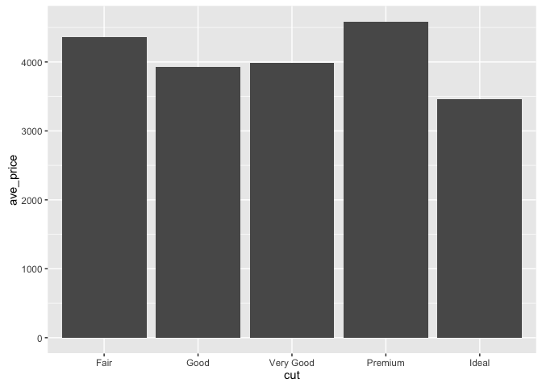

I love Shiya: The Analytical Romance
====================================

Let's look at the types of diamonds I can waste money on. First, we'll load the data.

``` r
library(dplyr)
library(ggplot2)

head(diamonds)
```

    ## Source: local data frame [6 x 10]
    ## 
    ##   carat       cut  color clarity depth table price     x     y     z
    ##   (dbl)    (fctr) (fctr)  (fctr) (dbl) (dbl) (int) (dbl) (dbl) (dbl)
    ## 1  0.23     Ideal      E     SI2  61.5    55   326  3.95  3.98  2.43
    ## 2  0.21   Premium      E     SI1  59.8    61   326  3.89  3.84  2.31
    ## 3  0.23      Good      E     VS1  56.9    65   327  4.05  4.07  2.31
    ## 4  0.29   Premium      I     VS2  62.4    58   334  4.20  4.23  2.63
    ## 5  0.31      Good      J     SI2  63.3    58   335  4.34  4.35  2.75
    ## 6  0.24 Very Good      J    VVS2  62.8    57   336  3.94  3.96  2.48

Now we want to see just how much money we can waste. We'll look at the average price according to the cut.

``` r
graph_data <- diamonds %>%
  group_by(cut) %>%
  summarize(ave_price = mean(price))

graph_data
```

    ## Source: local data frame [5 x 2]
    ## 
    ##         cut ave_price
    ##      (fctr)     (dbl)
    ## 1      Fair  4358.758
    ## 2      Good  3928.864
    ## 3 Very Good  3981.760
    ## 4   Premium  4584.258
    ## 5     Ideal  3457.542

``` r
g <- ggplot(data = graph_data, aes(x = cut, y = ave_price)) +
  geom_bar(stat = "identity")

g
```

<!-- -->

Wow! That's a lot of money!
